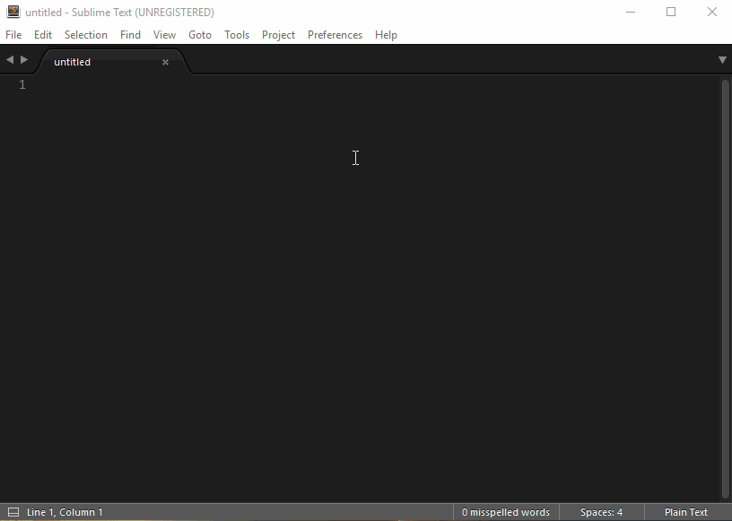

# CS-Script.ST3

CS-Script (C# intellisense) plugin for Sublime Text 3
The true C# intellisense and script execution solution based on CS-Script and Roslyn. 

*******************************************************

**Required minimum system configuration:**
 * .NET:       v4.0/4.5
 * CS-Script:  v3.19
 
*******************************************************

_This page is a light version of the complete overview of the complete plugin functionality, which can be found on [Wiki](https://github.com/oleg-shilo/cs-script-sublime/wiki). This includes_
 * _Detailed description of CS-Script functionality_
 * _Support for C# 6 on Windows_
 * _Notes on deployment on OS X_
 * _..._

## Installation

Note the plugin was developed and tested against ST3 but not ST2.

*__Package Control__*

The plugin is yet to be submitted to the Package Control. 

*__Manual__*

* Remove the package, if installed, using Package Control.
* Add a repository: `https://github.com/oleg-shilo/cs-script-sublime.git`
* Install `cs-script-sublime` with Package Control. 
* Restart Sublime editor if required

You can also install the plugin by cloning `cs-script-sublime` repository into your Packages folder or manually placing the download package there.

Mac users may need to do one extra step - read these [instructions](https://github.com/oleg-shilo/cs-script-sublime/wiki/Installing-plugin-on-OS-X).

## Overview

### _Plugin_ 
The plugin allows convenient editing and execution of the C# code (scripts) directly from the editor. It brings the true C# intellisense experience that typically comes with full scale IDEs. This includes the usual "Completion suggestions", "Go to Definition", "Find all references" and many other features that can be found in Visual Studio. In the heart of the plugin are two core components CS-Script and Roslyn. 

Roslyn is an Open Source .NET code analysis and compilation service. It is the very same syntax engine that another popular intellisense solution is built around - OmniSharp. The CS-Script plugin intellisense features are quite similar to what OmniSharp can deliver except that this plugin is more tuned up for the execution of generic scripts written with C#, while OmniSharp is usually (while not always) a part of the various ASP.NET toolsets. 

### _CS-Script_ 
CS-Script is a portable Open Source CLR based scripting system, which uses ECMA-compliant C# as a programming language. It allows execution of C# code directly without the need for a dedicated compilation step. It is arguably the most mature C# scripting solution available today. It was developed in 2004, two years after the very first .NET release. And it was on the scene many years before the first public release in 2014 of MS own compilation service (Roslyn) that eventually would deliver some elements of C# scripting. 

CS-Script is enormously influenced by the Python execution model. A single script file is sufficient to execute a C# routine without dealing with any C# project infrastructure or pre-compilation of C# code. It's also possible to import/include other scripts and assemblies (DLLs). CS-Script is not an interpreted but rather a statically typed compiled environment and as such, when combined with advanced Python-like caching, it delivers an ultimate performance not comparable but identical to the performance of the fully compiled .NET application. 

### C# scripting with Sublime
CS-Script ST3 plugin allows convenient editing and execution of the C# code directly from the editor. A C# script is any ECMA-compliant C# code. While any other C# based runtimes require C# code to be compiled into assemblies CS-Script allows direct C# execution by generating the assemblies on-fly. Thus you don't need to have any script specific configuration for executing your script. A single script file is fully sufficient as it contains everything that CS-Script needs to know to execute the script. 

When your C# script depend on other (source and compiled) C# source modules you can express this in your code in a very simple way via `//css_*` directives. These directives are conceptually similar to Python `import *`, which appear on top of the script. CS-Script has only a handful directives that are easy to remember. However if you forgot them you can always invoke "Show CS-Script Help" or "Show Plugin Help" command either from context menu or from "Command Palette".

Alternatively you can place the cursor on the directive (e.g. `//css_re|f`) and press F12 to trigger "Go To Definition" command to get the full information about the directive.   

And of course you can find the complete CS-Script documentation on GigHub: https://github.com/oleg-shilo/cs-script/wiki

